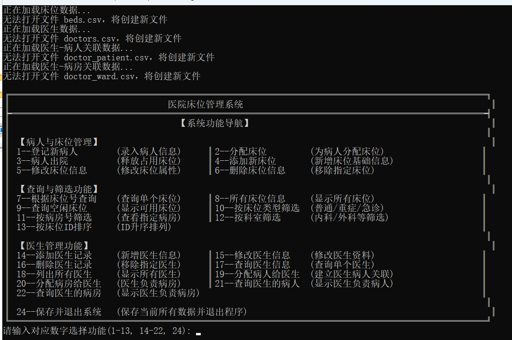

# 医院床位管理系统

## 项目简介
该项目是一个医院床位管理系统，旨在帮助医院管理病人信息、床位信息以及医生信息。系统提供了一系列功能以提高医院的管理效率。

## 功能概述
- **病人管理**：登记新病人、分配床位、查询床位信息、病人出院等。
- **床位管理**：添加新床位、修改床位信息、删除床位、查询空闲床位等。
- **医生管理**：添加医生记录、修改医生信息、删除医生记录、查询医生信息、分配病人给医生、分配病房给医生等。

## 使用说明
1. **编译程序**：使用C语言编写，确保安装了C编译器。
2. **运行程序**：编译后生成可执行文件`hospitalBedManagement.exe`，双击运行。
3. **依赖项**：无特殊依赖项，标准C库即可。

## 配置要求
- Windows操作系统
- C语言编译器
